# pre_cub3d
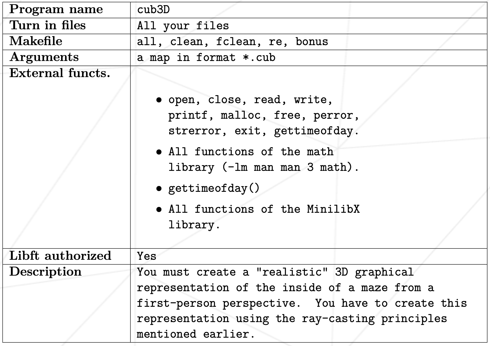

## raycasthing
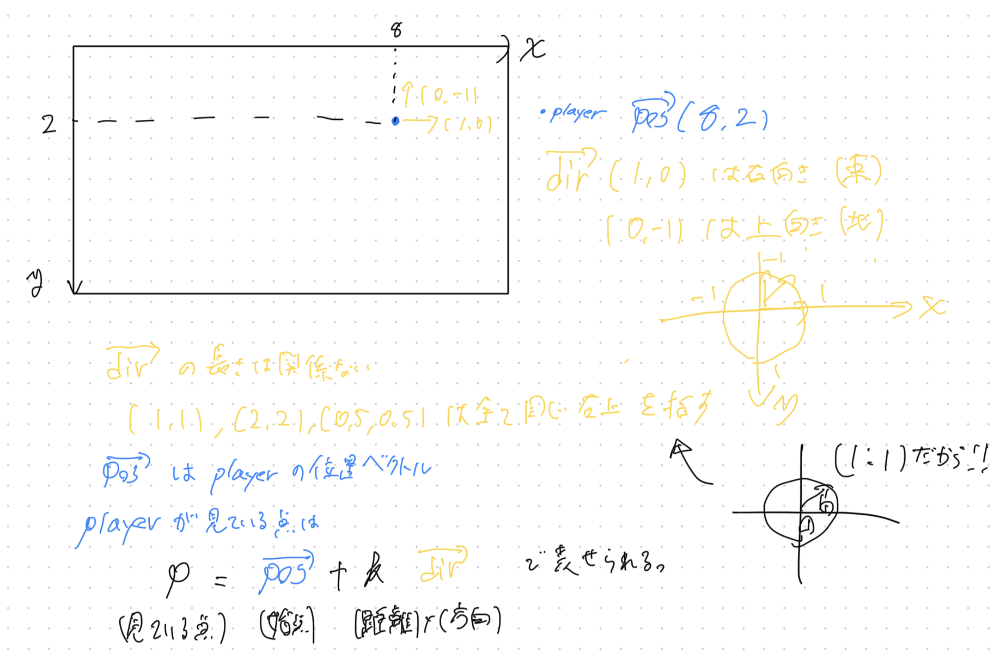

- ベクトルとカメラの概念を使ったものにする
- カメラ平面ベクトルを追加する、実際には平面ではなく直線として扱い、１つのベクトルで表現する
- カメラ平面は常に方向ベクトルと垂直である必要がある
- カメラ平面とはコンピュータの画面の表面
- 方向ベクトルとはその表面に垂直でカメラの内部(つまり奥行き)を指す
- プレイヤーの位置は単一の点としてカメラ平面の前面にある
- 画面の特定のx座標に対応するrayはこのプレイヤーの位置から始まり、画面上のその位置(つまり、カメラ平面上の位置)を通過するrayとなる
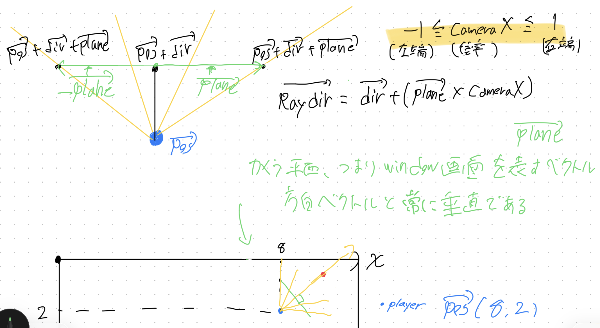
- 光線のベクトルをdirベクトルにカメラベクトルをかけて表現
- カメラの左端から右端を-1< plane <1の範囲と定めて定数倍する
- 実際には0から画面幅ぶんループで回し、中で-1から1に対応させる
```c
for(int x = 0; x < w; x++) // xは 0 から 画面幅(w) まで回す
{
    // ここで x を -1(左) 〜 0(中央) 〜 1(右) に変換する！
    double cameraX = 2 * x / (double)w - 1; 

    // ...以降の計算
}
```
### なぜこの方がいいのか？
もしループを -320 から +320 で回してしまうと、今度は画面に絵を描画するとき（mlx_pixel_put や画像バッファへの書き込み時）に、「配列のインデックスにマイナスの値が入ってしまう」 という問題が起きるからです。
- 計算: -1 〜 1 の世界（cameraX）で行う
- 描画とループ: 0 〜 Width の世界（x）で行う
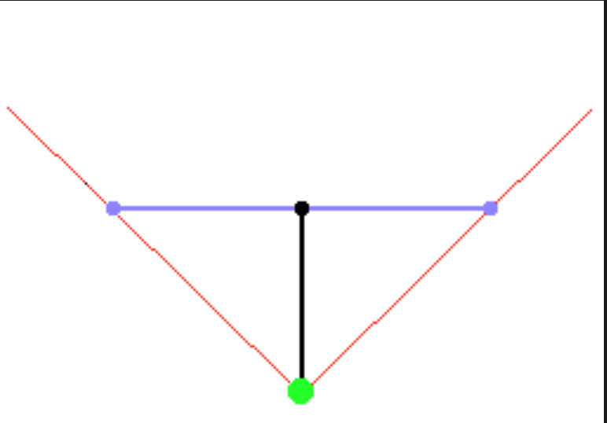
- 視野角は両端のrayである
- dirとplaneの長さの比率によって決まる
- dirとplaneが等しい時、FOVは90度になる
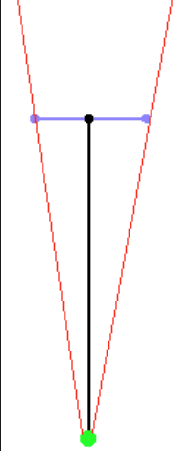
- dirがplaneよりかなり長い場合は、90度よりずっと狭くなる
- が代わりに詳細に見れるようになる
- ズームインと同じ
- plane平面が描画されるフレーム
- dirが小さい、つまりフレームがpos(目)に近いと視野が広く見える
- 逆に遠いと狭い範囲、遠くを大きく見ることができる
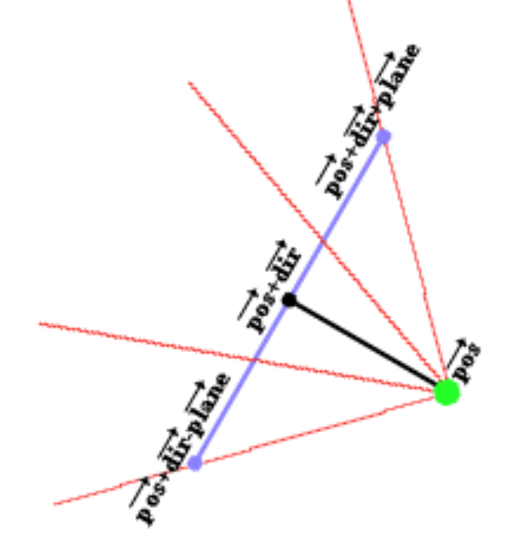
- playerが回転した時はdir,planeベクトル両方も回転させる
- そうすれば光線ベクトルも回転できる
- 回転行列をかける必要あり  
$[cos(a) - sin(a)]$\
$[sin(a) - cos(a)]$  
## raycastの開始
- いくつかの変数を用意
- posX,posY(プレイヤーの位置ベクトル)
- dirX,dirY(プレイヤーの進行方向)
- planeX,planeY(プレイヤーのカメラ平面)
- カメラ平面は進行方向に対して常に垂直
- 進行方向ベクトルとカメラ平面ベクトルの長さの比率が視野角を決定する
- time(現在のフレーム)
- oldtime(前のフレーム時間)
- この二つの時間差は、特定のキーを押された時にどれだけ移動するべきかを決定するために使用
- フレーム計算に時間がかかっても一定の速度で移動できるようにするため
```cpp
int main(int /*argc*/, char */*argv*/[])
{
  double posX = 22, posY = 12;  //x and y start position
  double dirX = -1, dirY = 0; //initial direction vector
  double planeX = 0, planeY = 0.66; //the 2d raycaster version of camera plane

  double time = 0; //time of current frame
  double oldTime = 0; //time of previous frame
}
```
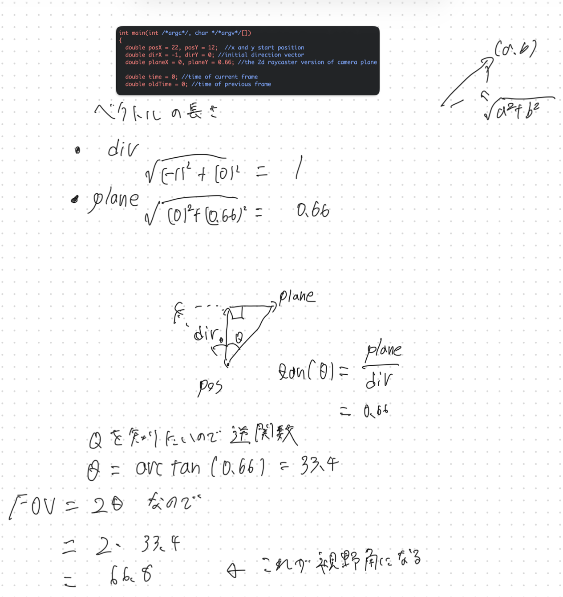

### ここからが実際のraycasting
- 全てのx座標を通過するループ
- ピクセルごとには計算しない
- いくつかの変数が宣言され、計算される
- rayはプレイヤーの位置(posX,posY)から始まる
- cameraXは現在のx座標(画面の幅)が表すカメラ平面上のX座標
- -1から1となるように設定(倍率となる)
```cpp

    for(int x = 0; x < w; x++)
    {
      //calculate ray position and direction
      double cameraX = 2 * x / double(w) - 1; //x-coordinate in camera space
      double rayDirX = dirX + planeX * cameraX;
      double rayDirY = dirY + planeY * cameraX;
```

### DDA algorithm
- DDAアルゴリズムに使われる変数が増える
- mapX,mapYはrayが現在いるマップのマス目
- rayの位置自体は浮動小数点数
- mapX,mapYは整数部分(つまりどのマス目の中か)のみを表す
- sideDistX,sideDistYはスタート地点から次にぶつかるX(またはY)壁までの合計距離
- deltaDistX,deltaDistYはrayが1つのx側壁から次のx側壁、1つのy側壁から次のy側壁まで移動するために必要な距離


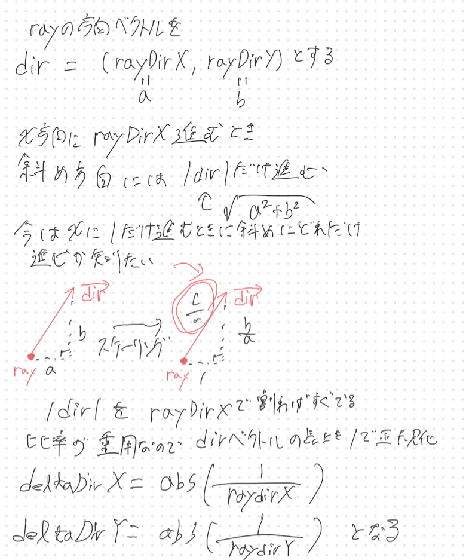

- 比率が重要なため単純に倍率で表せる
- DDAはループごとに一つのマスずつ移動する
- 負または正の方向、どちらに移動するべきかをstepX,stepYに格納(-1,1のどちらかが常に入る)
- hitは次のループを終了可能かの判断フラグ
- sideはヒットした壁がxかyかを判断、x壁なら0,y壁なら1になる
- ０除算を避けるためrayDirX,Yが0の場合は非常に大きな値である1e30を設定
```cpp
   //which box of the map we're in
      int mapX = int(posX);
      int mapY = int(posY);

      //length of ray from current position to next x or y-side
      double sideDistX;
      double sideDistY;

       //length of ray from one x or y-side to next x or y-side
      double deltaDistX = (rayDirX == 0) ? 1e30 : std::abs(1 / rayDirX);
      double deltaDistY = (rayDirY == 0) ? 1e30 : std::abs(1 / rayDirY);
      double perpWallDist;

      //what direction to step in x or y-direction (either +1 or -1)
	  //どちらに進むかを保存
      int stepX;
      int stepY;

      int hit = 0; //was there a wall hit?
      int side; //was a NS or a EW wall hit?
```

```cpp
  //calculate step and initial sideDist
      if (rayDirX < 0)
      {
        stepX = -1;
        sideDistX = (posX - mapX) * deltaDistX;
		//負の方向に進むならそこまでの距離、にdeltaDistXをかけて斜めの距離が出せる
      }
      else
      {
        stepX = 1;
        sideDistX = (mapX + 1.0 - posX) * deltaDistX;
		//正方向なら1を足してから引くことで、右の壁までの距離が出る、あとは上に同じ
      }
      if (rayDirY < 0)
      {
        stepY = -1;
        sideDistY = (posY - mapY) * deltaDistY;
      }
      else
      {
        stepY = 1;
        sideDistY = (mapY + 1.0 - posY) * deltaDistY;
      }
```

```cpp
      //perform DDA
	  //先に衝突する方へ進める
	  //一つ進めたらスタート地点からの次に衝突するまでの距離(sideDist)を増やす
	  //x方向に進めたなら次に衝突するまでの距離はもう一つ分斜めの距離を足す
      while (hit == 0)
      {
        //jump to next map square, either in x-direction, or in y-direction
        if (sideDistX < sideDistY)
        {
          sideDistX += deltaDistX;
          mapX += stepX;
          side = 0;//x壁
        }
        else
        {
          sideDistY += deltaDistY;
          mapY += stepY;
          side = 1;//y壁
        }
        //Check if ray has hit a wall
        if (worldMap[mapX][mapY] > 0) hit = 1;
      } 
```
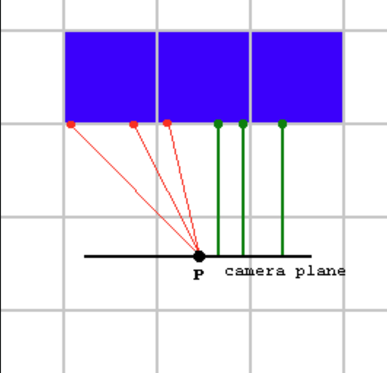
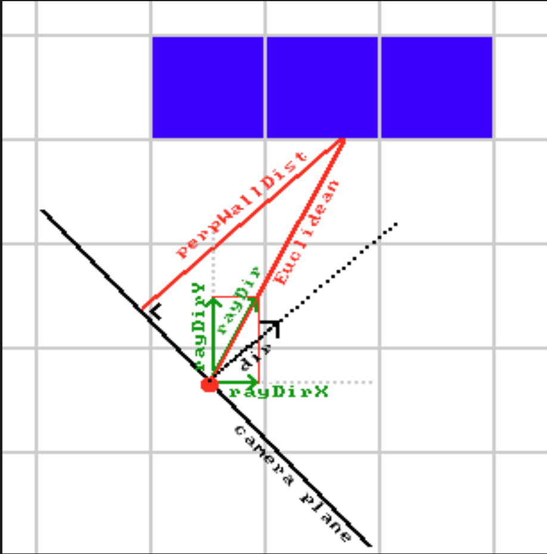

### rayと壁の距離の計算
- カメラ平面からの距離を出す(魚眼効果を出さないため)
- プレイヤー(点)からの距離を出すと端が小さくなってしまう
- 距離というよりはカメラ平面からの奥行きを測っているイメージ
- 赤線がダメな例、緑が正しい(左図)
- 魚眼効果の回避、perpWallDist(右図)
```cpp
     //Calculate distance projected on camera direction (Euclidean distance would give fisheye effect!)
      if(side == 0) perpWallDist = (sideDistX - deltaDistX);
      else          perpWallDist = (sideDistY - deltaDistY);
```
- ループが止まった瞬間の sideDistX は、「壁に当たった地点（壁の表面）」ではなく、「その壁を通り抜けた次の境界線（壁の裏側）」までの距離
- だから「1ステップ戻る」

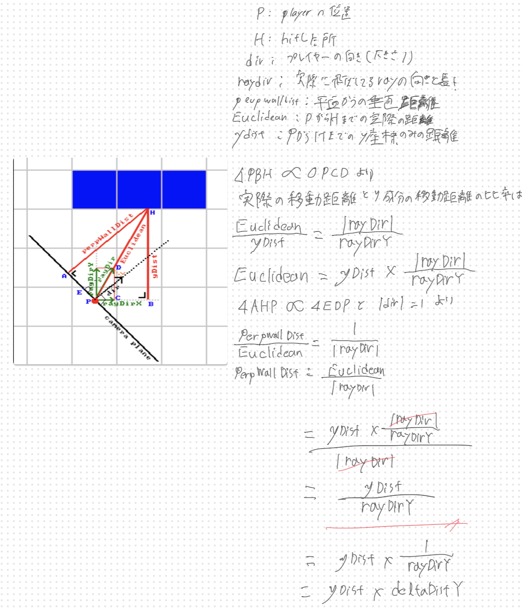

### 壁の高さを決める
- 「距離（perpWallDist）」で「画面の高さ（h）」を割り算
- 画面の中心(h / 2)から壁の高さの半分上をdrawStart
- 半分下をdrawEndにする
- はみ出る場合は上端を０、下端をh-1で設定

```cpp

      //Calculate height of line to draw on screen
      int lineHeight = (int)(h / perpWallDist);

      //calculate lowest and highest pixel to fill in current stripe
      int drawStart = -lineHeight / 2 + h / 2;
      if(drawStart < 0)drawStart = 0;
      int drawEnd = lineHeight / 2 + h / 2;
      if(drawEnd >= h)drawEnd = h - 1;
```

### 描画開始
```cpp

      //choose wall color
      ColorRGB color;
      switch(worldMap[mapX][mapY])
      {
        case 1:  color = RGB_Red;  break; //red
        case 2:  color = RGB_Green;  break; //green
        case 3:  color = RGB_Blue;   break; //blue
        case 4:  color = RGB_White;  break; //white
        default: color = RGB_Yellow; break; //yellow
      }
	  //mapの数値によって色を変えてる。cub3dではテクスチャ画像で処理

      //give x and y sides different brightness
	  //壁の向きによって明るさを変える
	  //side=1のy壁は明るさが半分になる
      if (side == 1) {color = color / 2;}

      //draw the pixels of the stripe as a vertical line
	  //0~drawstart -> 天井(c)
	  //drawstart~drawend -> 壁(テクスチャの範囲)
	  //drawend~h -> 床(f)
	  //で縦線を引く、これをx=0 ~ widthまでループを繰り返す
      verLine(x, drawStart, drawEnd, color);
    }
```

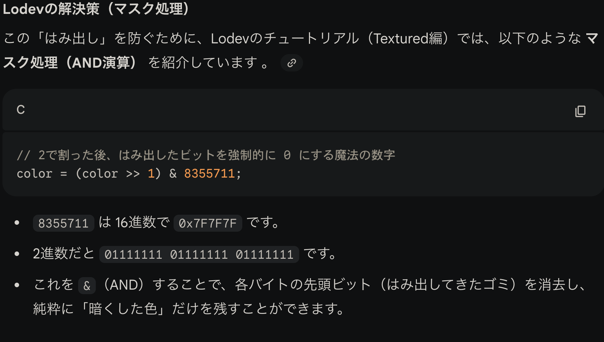
&演算はこっちを0に設定しておけば相手が何でも0にできる。
逆にこっちを１に設定しておくと相手には何の影響もない。

## ゲームループ
### 1. 時間計測とfps計算
- **処理**：現在の時刻と前のフレームの時刻の差を計算
- **目的**
	1. FPSの表示、どれくらい滑らかに動いてるかの確認
	2. 移動速度の補正
		- pcの性能によってfpsは変わる
		- １フレームで１マス進む、としてしまうとハイスペックpcでは超高速で移動してしまう
		- これを防ぐために経過時間を移動料に掛け算する
		- これで１秒間に進む距離を一定に保つ
### 2. 画面の再描画
- **処理**：計算した壁やFPSの数値をモニターに見えるように反映
- **cub3d**
	- minilibxではメモリ上（img.data）でピクセルを書き換えただけでは画面に反映されない
	- 最後に mlx_put_image_to_window を呼んで、画像データをウィンドウに転送する処理がこれに当たる
### 3. バックバッファのクリア
- **処理**：画面を真っ黒に塗りつぶしてリセット
- **目的**
	- もし消さないと、「前のフレームの絵」が残ったままになります。
	- 壁が動いた後、壁が「あった場所」に古い壁の絵が残ってしまい、画面が残像だらけ（Smearing / Ghosting）になってしまいます。
	- 毎回真っ黒（あるいは天井と床の色）で塗りつぶすことで、常に新しいきれいな景色を描画できるようにします。
- **cub3d**
	- cls()の実装が必要
	1. **背景描画**: 画像全体を「天井の色」と「床の色」で塗りつぶす（実質的な cls）。
	2. **壁描画**: レイキャスティングで壁を上書き描画する。
	3. **表示**: mlx_put_image_to_window で画面に出す。
	4. **ループ**: 1に戻る。
```cpp

    //timing for input and FPS counter
    oldTime = time;
    time = getTicks();
    double frameTime = (time - oldTime) / 1000.0; //frameTime is the time this frame has taken, in seconds
    print(1.0 / frameTime); //FPS counter
    redraw();
    cls();

    //speed modifiers
    double moveSpeed = frameTime * 5.0; //the constant value is in squares/second
    double rotSpeed = frameTime * 3.0; //the constant value is in radians/second
```
## 入力とキー
### 1. 前後移動のロジック
```cpp
if (keyDown(SDLK_UP)) // 上キー（前進）
{
  // 1. X方向に進んだ先に壁がないかチェック
  if(worldMap[int(posX + dirX * moveSpeed)][int(posY)] == false) 
      posX += dirX * moveSpeed; // 壁がなければX座標を更新

  // 2. Y方向に進んだ先に壁がないかチェック
  if(worldMap[int(posX)][int(posY + dirY * moveSpeed)] == false) 
      posY += dirY * moveSpeed; // 壁がなければY座標を更新
}
```
### 1. 回転のロジック
```cpp
if (keyDown(SDLK_RIGHT)) // 右回転
{
  double oldDirX = dirX;
  // 回転行列の公式 (X' = Xcosθ - Ysinθ)
  dirX = dirX * cos(-rotSpeed) - dirY * sin(-rotSpeed);
  // 回転行列の公式 (Y' = Xsinθ + Ycosθ)
  dirY = oldDirX * sin(-rotSpeed) + dirY * cos(-rotSpeed);

  // カメラ平面（plane）も一緒に回す！
  double oldPlaneX = planeX;
  planeX = planeX * cos(-rotSpeed) - planeY * sin(-rotSpeed);
  planeY = oldPlaneX * sin(-rotSpeed) + planeY * cos(-rotSpeed);
}
```
```cpp
double oldDirX = dirX;
dirX = ...; // ここで dirX が新しい値に書き換わる！
dirY = oldDirX * ...; // 古い dirX を使う必要がある
```
## テクスチャに対応させる
